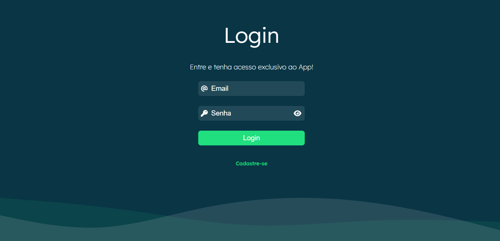
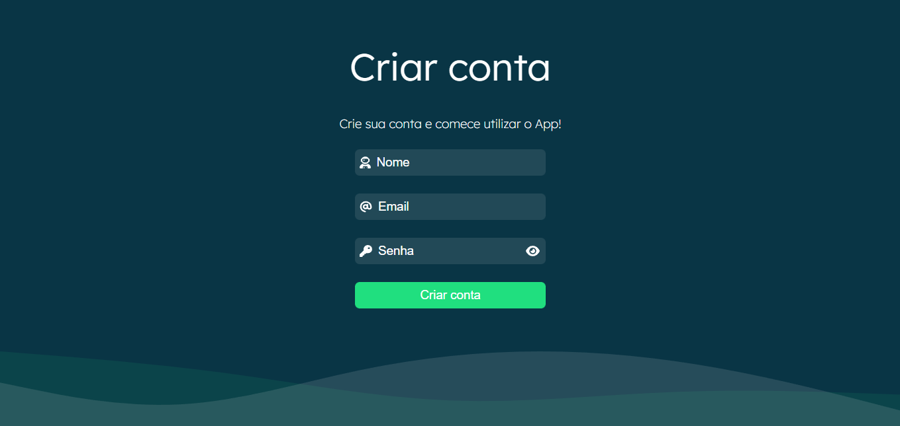

# Projeto Cadastro de usuário - Front-end
[](https://github.com/wendellmoraisz/cadastro-usuario-client/blob/main/LICENSE) <br>

O projeto simula um sistema de login, dando a possibilidade de ser criada uma nova conta pelo usuário.

# Tecnologias utilizadas
- [TypeScript](https://www.typescriptlang.org/)
- [ReactJS](https://reactjs.org/)
- [Styled-Components](https://styled-components.com/)


# Screenshots
### Tela de login



### Tela de cadastro



# Requisitos mínimos para executar o projeto
Ter o [Node.js](https://nodejs.org/en/download/) instalado na sua máquina.

# Como rodar o projeto

Primeiramente, inicie o [servidor](https://github.com/wendellmoraisz/cadastro-usuario-server) seguinto suas instruções.

Feito isso, execute os seguintes passos:
```bash

# clone o repositório
git clone https://github.com/wendellmoraisz/cadastro-usuario-client

#entre no diretório do projeto e execute os seguintes comandos no seu terminal:
npm install
npm start
